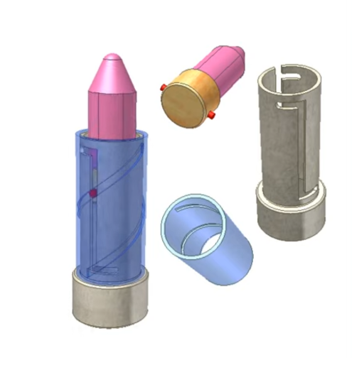
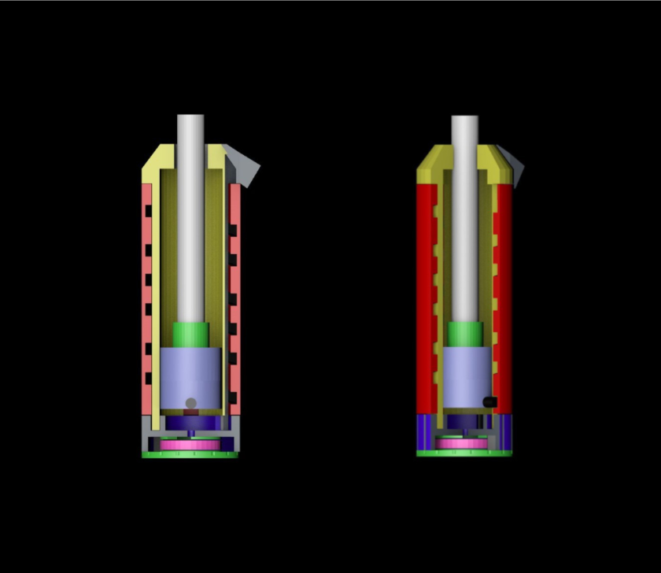
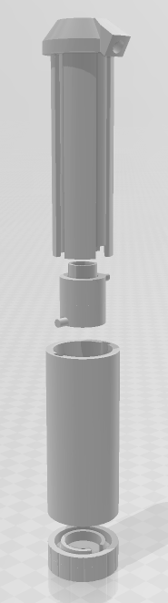
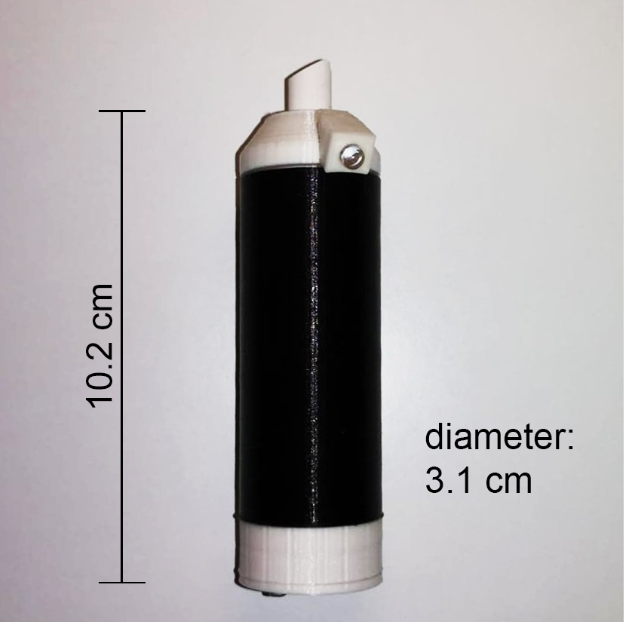

# Chalk2Me
A univerisity project done for the course of Computing Systems (Politecnico di Milano, Engineering Physics).

## Introduction
Being students during the pandemic made us see in first person the transition from traditional lectures to online and then to mixed ones (in-person lectures with a percentage of students following from home). Professors employed many different approaches, from using a webcam to record the black board to pivoting to just using slides. Every approach has some pros and cons, but none was optimal for everyone; for this reason we decided to develop a cheap and effective solution that could be easily implemented in every classroom while also optimizing the experience both from the classroom and from home.

## Our Solution
Inspired by projects like [Wiimote Whiteboard](https://archive.org/details/wiimote-whiteboard), we designed a casing for the chalk that has a pressure sensor that detects when the professor writes on the board and an IR led that allows for the movement tracking. The tracking itself can be easily done with a Wiimote. 

Here is a demo of the device in function:

## Design
The main issue we encountered was the fact that the chalk itself gets consumed while writing and therefore we needed the height of the chalk to be adjustable to ensure the best writing experience. The final design was based on the typical lipstick casing:

A main challenge was to make sure that the internal wires could not get tangled in the motion of the chalk, the final design is the following:

 

Here is a better view with the components disassambled:

And here is the 3D printed prototype:

All the .stl files can be found in the "Mesh" folder of the repository.

## Promotion Video
As part of the project we had also to produce a small video presentation, to do this we used Blender for the animations, Premiere for editing and After Effects for the motion graphics. The video can be seen here:

https://github.com/aristofanee/Chalk2Me/assets/75656110/06e2c9fa-5131-44b8-b700-34b12e5719cb

## Software
In parallel with the design we also wanted to develop the software to complement our product. The software is written in C with the use of the Wiiuse, GLWF and OpenGL libraries. Nonetheless, this was not the focus of the project and the software is still in the early stages of development.
